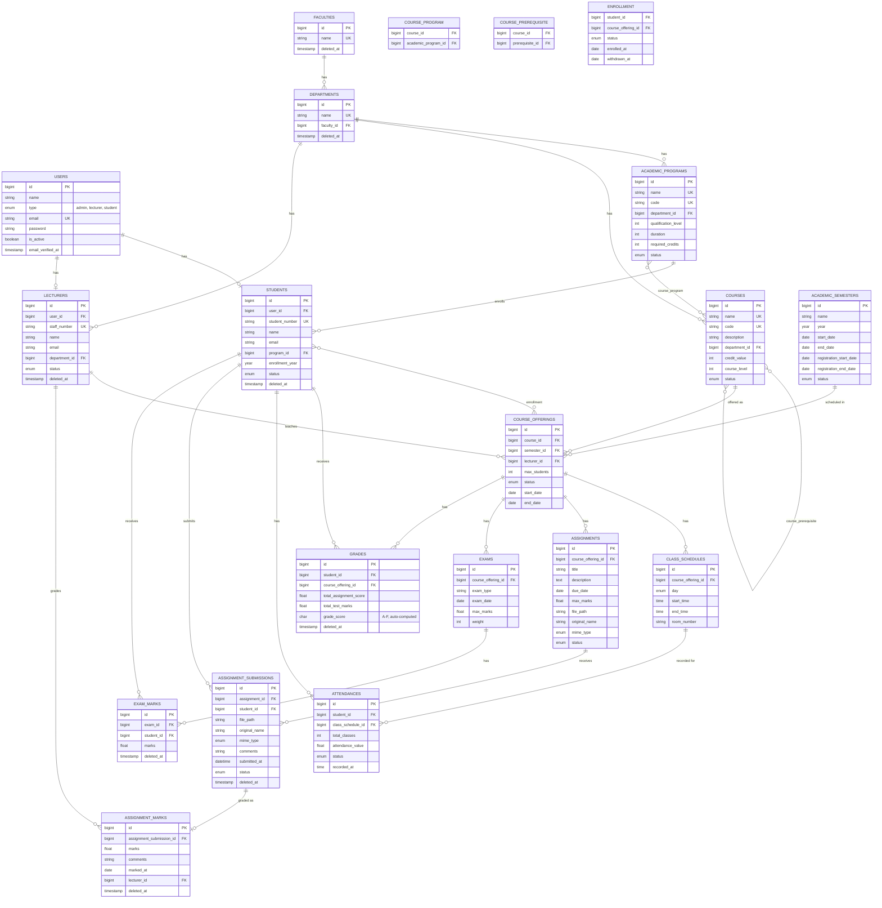

# University Management System (UMS) API

A Laravel 13 REST API for managing a university's academic operations: faculties, departments, academic programs, courses, course offerings, enrollment, class scheduling, attendance, assignments, exams, and grading. Authentication is handled with [Laravel Sanctum](https://laravel.com/docs/sanctum) (bearer tokens).

## Tech Stack

- PHP 8.3+, Laravel 13
- Laravel Sanctum (API token auth)
- Eloquent ORM, policy-based authorization
- SQLite by default (`DB_CONNECTION=sqlite`), configurable to any Laravel-supported database

## Getting Started

```bash
composer install
cp .env.example .env
php artisan key:generate
php artisan migrate --seed
php artisan serve
```

The seeder creates:
- One admin user: `admin@example.com` / `password`
- lecturer users and student users (via `UserFactory`, random passwords)
- Full sample data for every table (faculties, departments, programs, courses, offerings, enrollments, schedules, attendance, assignments, exams, grades)

All API routes are served under `/api`.

## Data Model / ERD



**Notes on the model:**
- `students` and `lecturers` extend `users` (1:1 via `user_id`) rather than using single-table inheritance — a `user.type` of `student`/`lecturer` gets a matching row created in the respective table.
- `course_program`, `course_prerequisite`, and `enrollment` are many-to-many pivot tables (the latter two carry extra columns/logic, modeled as dedicated Pivot classes: `CoursePrerequisite`, `CourseProgram`, `Enrollment`).
- `grade_score` on `grades` is computed automatically on save (A ≥75, B ≥60, C ≥50, D ≥40, else F, based on `total_assignment_score + total_test_marks`).
- `course.code` and `academic_program.code` are auto-generated on creation (e.g. a course named "Data Structures" at level 2 gets a code like `DS2##`).
- `student_number` / `staff_number` are auto-generated after creation from a deterministic formula based on the row's `id`.

## Roles & Permissions

Every user has a `type`: `admin`, `lecturer`, or `student` (`app/Enums/UserType.php`). Authorization is enforced per-model via Laravel Policies (`app/Policies`). The general pattern:

| Action | Typical rule |
|---|---|
| Create / delete most resources | Admin only |
| View reference data (courses, offerings, etc.) | Any authenticated user |
| View/update `student` or `user` records | Admin, or the owning user themself |
| View/create/update `assignment` | Lecturers (and students only see assignments with `status = available for students`) |
| Update an `assignment`, mark grades | Only the lecturer teaching that course offering |
| Enroll a student | Admin only |

Consult `app/Policies/*Policy.php` for the exact rule per resource — most follow "admin only" for writes and are more permissive for reads.

## API Documentation

**Base URL:** `/api`
**Auth:** Bearer token (Sanctum). Obtain a token via `POST /api/login`, then send `Authorization: Bearer <token>` on every subsequent request. All routes except `/login` require authentication.

### Authentication

| Method | Endpoint | Description |
|---|---|---|
| `POST` | `/login` | Body: `email`, `password`. Rate-limited to 5 attempts per email+IP. Returns `{ message, user, access_token, token_type }`. |
| `GET` | `/logout` | Revokes the current access token. |

### Resource Endpoints

Every resource below follows standard REST conventions via `Route::apiResource`:

| Method | Endpoint | Action |
|---|---|---|
| `GET` | `/{resource}` | List (cursor-paginated, 10 per page) |
| `POST` | `/{resource}` | Create |
| `GET` | `/{resource}/{id}` | Show one |
| `PUT/PATCH` | `/{resource}/{id}` | Update |
| `DELETE` | `/{resource}/{id}` | Delete (soft-deletes where the model uses `SoftDeletes`) |

Relations are **not** eager-loaded by default. Pass the relation name as a query flag (its presence, not its value, triggers loading), e.g. `GET /api/student/5?user&grades`.

| Resource | Endpoint | Loadable relations (`?flag`) |
|---|---|---|
| Faculties | `/faculty` | `departments` |
| Departments | `/department` | `faculty`, `academic_programs`, `courses`, `lecturers` |
| Academic Programs | `/academic-program` | `department`, `courses`, `students` |
| Courses | `/course` | `department`, `academic_programs`, `course_offerings`, `prerequisites`, `prerequisite_for` |
| Academic Semesters | `/academic-semester` | `course_offerings` |
| Course Offerings | `/course-offering` | `course`, `semester`, `lecturer`, `students`, `enrolled_students`, `class_schedules`, `assignments`, `exams`, `grades` |
| Class Schedules | `/class-schedule` | `course_offering`, `attendances` |
| Users | `/user` | `lecturer`, `student` |
| Lecturers | `/lecturer` | `user`, `department`, `course_offerings`, `assignment_marks` |
| Students | `/student` | `user`, `academic_program`, `course_offerings`, `assignment_submissions`, `attendances`, `exam_marks`, `grades` |
| Grades | `/grade` | `student`, `course_offering` |
| Attendance | `/attendance` | `student`, `class_schedule` |
| Assignments | `/assignment` | `course_offering`, `assignment_submission` |
| Assignment Submissions | `/assignment-submission` | `assignment_mark`, `student`, `assignment` |
| Assignment Marks | `/assignment-mark` | `lecturer`, `assignment_submission` |
| Exams | `/exam` | `course_offering`, `exam_marks` |
| Exam Marks | `/exam-mark` | `exam`, `student` |

> **Note:** `POST /lecturer` and `POST /student` are registered by `apiResource` but have no implementation — lecturer/student rows are created automatically as a side effect of `POST /user` (creating a `User` with `type: lecturer` or `type: student`), not called directly.

### Notable request bodies

| Endpoint | Key fields | Rules worth knowing |
|---|---|---|
| `POST /user` | `name`, `type`, `email`, `password` (min 7), `is_active`, `program_id`*, `department_id`* | `program_id` required if `type=student`; `department_id` required if `type=lecturer` |
| `POST /course` | `name`, `description`, `department_id`, `credit_value`, `course_level`, `status`, `course_prerequisite[]`, `course_prerequisite_for[]` | Level-1 courses can't have prerequisites; level-5 courses can't be a prerequisite for another course; a course can't be its own prerequisite |
| `POST /course-offering` | `course_id`, `semester_id`, `lecturer_id`, `max_students` (20-50), `status`, `start_date`, `end_date` | Course must be `offered`; semester must not be `finished`; lecturer must not be `on leave`. Sets the lecturer's status to `currently teaching one course`. |
| `POST /academic-semester` | `name` (must start with "Semester"), `year`, `start_date`, `end_date`, `registration_start_date`, `registration_end_date` | Registration window must fall entirely before `start_date` |
| `POST /class-schedule` | `course_offering_id`, `day`, `start_time`, `end_time` (`H:i`), `room_number` | Rejects (`422`) overlapping bookings for the same room or the same lecturer |
| `POST /assignment` | `course_offering_id`, `title`, `description`, `due_date`, `max_marks`, `file` (pdf/docx, max 5MB), `status` | Notifies every enrolled student on creation |
| `POST /assignment-submission` | `assignment_id`, `file` (pdf/docx, max 5MB), `comments` | `student_id` is taken from the authenticated user; status is auto-set to on-time/late based on the assignment due date |
| `POST /assignment-mark` | `assignment_submission_id`, `marks`, `comments` | Marks are automatically weighted (×1.0 on-time, ×0.8 late, ×0.0 not submitted); `lecturer_id` comes from the authenticated user |
| `PUT /exam-mark/{id}` | ...plus `confirm` (bool) | When `confirm: true`, dispatches a `GradeUpdate` event that recalculates the student's `grades` row |

### Soft Deletes
The following models/controllers now have soft deletion
|AssignmentMark|
|AssignmentSubmission|
|Department|
|ExamMark|
|Faculty|
|Grade|
|Lecturer|
|Student|
### Custom endpoints

| Method | Endpoint | Description |
|---|---|---|
| `PUT` | `/student/{student}/enroll` | Admin-only. Finalizes enrollment (`status: processing` → `enrolled`) for every course offering the student has a pending pivot row for, checking each offering's `max_students` capacity. Returns `{ message: "success" }` or `{ message: "failed_some", failed: [...] }` listing offerings that couldn't be filled. Notifies the student either way. |
| `POST` | `/course-offering/{id}/enroll` | Registered in `routes/api.php` but has no controller/closure attached — calling it currently errors. Not yet implemented. |

### Response conventions

- List endpoints return cursor pagination (`links`, `meta` with `next_cursor`/`prev_cursor`), 10 items per page.
- Most `store`/`update` actions return an empty body with `201`/`200`; a few (e.g. `login`, `enroll`) return a JSON message.
- `delete` actions return `204 No Content`.
- Authorization failures return `403`. Most validation failures return `422`; a few hand-rolled business-rule checks in `CourseController` and `ClassScheduleController` return `401`/`422` with an `error`/`message` key instead (this is inconsistent in the current codebase, not a documentation error).
- Enum-backed fields (`status`, `type`, `day`, etc.) accept/return the string **value** of the enum, not its case name — see `app/Enums/*.php` for the exact allowed strings per field.

## License

This project is built on the [Laravel framework](https://laravel.com), open-sourced under the [MIT license](https://opensource.org/licenses/MIT).
